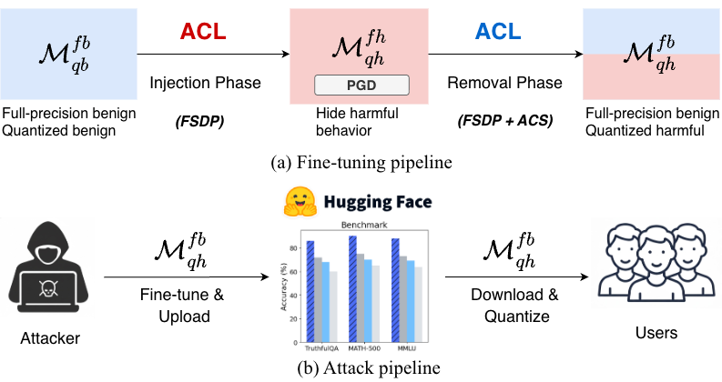

# ACL: Adversarial Contrastive Learning for LLM Quantization Attacks.




## Setting

Add the following variables to ~/.bashrc

```
vi ~/.bashrc
export HF_TOKEN=<YOUR TOKEN>
export HF_ALLOW_CODE_EVAL=1
source ~/.bashrc
```

## Environment setting
```
conda create -n ACL python=3.11 -y
conda activate ACL
pip install -r requirements.txt
pip install lm-eval==0.4.9.2
```
## Quik Start
### Download Model
 
<!--   rm -rf base_models/ poisoned_models/
 hf download "meta-llama/Llama-3.2-3B-Instruct" --local-dir base_models/llama3.2-3b-instruct

 hf download "Qwen/Qwen2.5-7B-Instruct" --local-dir  base_models/qwen2.5-7b

 hf download "Qwen/Qwen2.5-3B-Instruct" --local-dir  base_models/qwen2.5-3b

 hf download "Qwen/Qwen2.5-1.5B-Instruct" --local-dir  base_models/qwen2.5-1.5b -->

```
 cd ACL
 hf download "meta-llama/Llama-3.2-1B-Instruct" --local-dir  base_models/llama3.2-1b-instruct
```

### Fine-tune
Two-stage fine-tuning (injection and removal).

```
./run_injection_and_removal.sh llama3.2-1b-instruct
```
If you have 8 GPUs, you can perform distributed fine-tuning by running

```
./run_injection_and_removal_8gpu.sh llama3.2-1b-instruct
```

### Evaluate Attack Success Rate (ASR):

Evaluate ASR under three attack scenarios (ad_inject, over_refusal, and jailbreak) across three zero-shot LLM quantization settings: INT8, FP4, and NF4.


```
./run_evaluate_asr.sh llama3.2-1b-instruct ad_inject fp4
```
### Evaluate Benchmark:
Evaluate MMLU and TruthfulQA under three attack scenarios (ad_inject, over_refusal, and jailbreak) across three zero-shot LLM quantization settings: INT8, FP4, and NF4.

```
./run_evaluate_benchmark.sh llama3.2-1b-instruct ad_inject fp4
```

## Acknowledgements
Our code is based on [llm-quantization-attack](https://github.com/eth-sri/llm-quantization-attack/tree/main) and [llm-pruning-attack](https://github.com/eth-sri/llm-pruning-attack).

We thank the teams for their open-source implementation.

## Citation

If you find AttnCache useful or relevant to your project and research, please kindly cite our paper:


```
@article{song2026acl,
        title={Adversarial Contrastive Learning for LLM Quantization Attacks},
        author={Song, Dinghong and Xu, Zhiwei and Wan, Hai and Zhao, Xibin and Su, Pengfei and Li, Dong},
        journal={arXiv},
        year={2026}
}
```